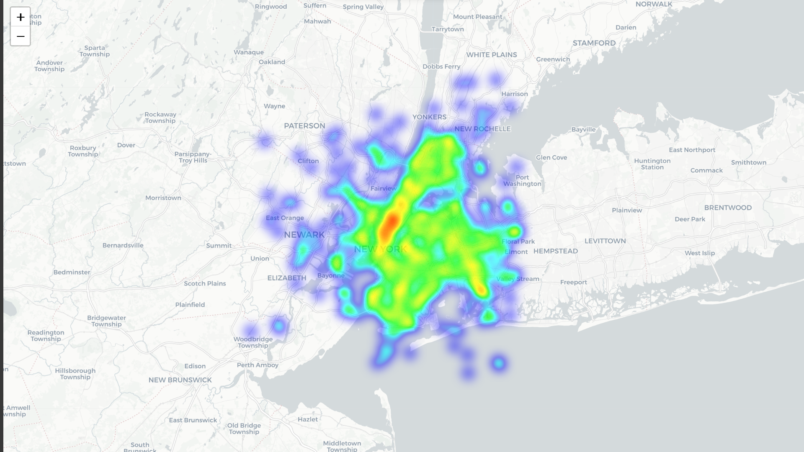
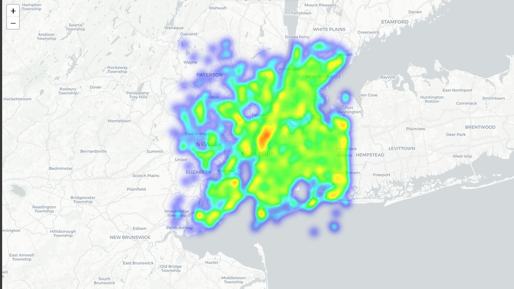

# Urban Mobility Data Analysis: NYC Uber Trips

[](https://urban-mobility-data-analysis.streamlit.app/)

## Project Overview
This project presents a comprehensive analysis of over 1.4 million Uber trips in New York City. The primary objective is to uncover patterns in urban mobility, identify demand hotspots, and build a robust forecasting model to predict future ride demand. The entire data pipeline—from cleaning and processing to modeling and visualization—is documented in the accompanying Jupyter Notebook.

The culmination of this analysis is an interactive web dashboard built with Streamlit, which allows users to explore the data and view demand forecasts dynamically.

## Key Features
- **Exploratory Data Analysis (EDA):** Deep dive into trip data to uncover hourly, daily, and weekly demand patterns.
- **Geospatial Hotspot Identification:** Visualization of high-demand pickup and drop-off zones across NYC using Folium heatmaps.
- **Predictive Forecasting:** A time-series forecasting model using Facebook's Prophet to predict hourly ride demand for up to 90 days in the future.
- **Interactive Dashboard:** A user-friendly Streamlit application to visualize key metrics, demand patterns, and future forecasts.

## 🚀 Dashboard Deployment
Explore the live, interactive dashboard here:
**[https://urban-mobility-data-analysis.streamlit.app/](https://urban-mobility-data-analysis.streamlit.app/)**

---

## My Project Journey: Struggles and Solutions

Building this project involved several technical challenges. Here’s a look at the hurdles I faced and how I overcame them:

### 1. Handling a Large Dataset
- **The Struggle:** The initial dataset contained over 1.4 million records. Loading this entire file into memory at once with pandas would be inefficient and could lead to memory errors, especially on a standard local machine.
- **The Solution:** I adopted a chunk-based processing approach. I read the raw CSV in smaller chunks of 100,000 rows and ingested them into an **SQLite database**. This strategy was not only memory-efficient but also made the data querying process faster and more scalable for the cleaning phase.

### 2. Data Cleaning and Preprocessing
- **The Struggle:** The raw data was noisy. It contained null values, trips with zero passengers, and significant outliers, such as trips starting or ending far outside the geographical boundaries of New York City (e.g., in other states). There were also trips with unrealistic durations (e.g., a few seconds or several hours).
- **The Solution:** I implemented a rigorous multi-step cleaning pipeline:
    - **Geographic Filtering:** I defined a bounding box for NYC and filtered out all trips that did not start and end within those coordinates. This immediately removed the most extreme location outliers.
    - **Logical Filtering:** I removed records with zero passengers and trips with durations that were either too short (<1 minute) or excessively long (>1.5 hours), as these likely represented data entry errors.
    - **Null Value Handling:** I dropped rows with any missing values to ensure the integrity of the dataset for analysis and modeling.

### 3. Feature Engineering for Time-Series Forecasting
- **The Struggle:** The cleaned data was at a trip-level, with each row representing a single ride. To perform time-series forecasting, I needed to aggregate this into a continuous time-series format showing demand per unit of time.
- **The Solution:** I used the `pandas.resample()` function to aggregate the trip data into **hourly demand counts**. I set the `pickup_datetime` as the index and resampled it to an hourly frequency ('h'). I also used `.asfreq('h', fill_value=0)` to ensure that time intervals with no rides were filled with a zero count, creating the continuous time series required for Prophet.

### 4. Choosing and Evaluating the Right Forecasting Model
- **The Struggle:** The hourly demand data exhibited multiple seasonalities (daily and weekly patterns). A simple linear model would not be able to capture these complex patterns effectively.
- **The Solution:** I chose **Facebook's Prophet model**, as it is specifically designed for time-series data with multiple seasonality components. It automatically decomposes the time series into trend, weekly, and daily patterns, which was perfect for this use case. To validate its effectiveness, I performed a 90/10 train-test split and evaluated the model using MAE, RMSE, and R². The model achieved an **R² of 0.77**, indicating it could explain 77% of the variance in demand, which gave me confidence in its predictive power.

### 5. Performance Issues with Geospatial Visualization in Streamlit
- **The Struggle:** When building the Streamlit dashboard, I initially tried to plot all 1.4 million pickup locations on the map. This caused the app to become extremely slow and often crash the browser due to the sheer volume of data points being rendered.
- **The Solution:** To maintain interactivity, I implemented two key optimizations:
    - I used `st.slider` to allow the user to select the number of data points to visualize, with a default of 5,000 and a maximum of 100,000.
    - Instead of plotting the entire filtered dataset, I took a **random sample** (`.sample(n=num_points_to_plot)`) from the data. This provided a representative view of the demand hotspots without sacrificing the performance of the web application.

---

## 📊 Key Findings & Insights

### 1. Time-Based Demand Patterns
- **Peak Hours:** Demand is highest during the evening commute (5-7 PM) and remains high into the late evening, especially on weekends. The lowest demand is in the early morning (4-5 AM).
- **Weekly Trends:** Demand steadily increases from Monday, peaking on **Friday and Saturday**, which are the busiest days for leisure and social activities.

### 2. Geospatial Hotspots
- **Manhattan is the Epicenter:** Both pickup and drop-off activities are overwhelmingly concentrated in Manhattan, particularly in areas like Midtown and the Financial District.
- **Secondary Hubs:** Significant demand is also observed near major airports (JFK and LaGuardia) and in parts of Brooklyn and Queens adjacent to Manhattan.

#### Pickup Location Heatmap


#### Drop-off Location Heatmap


### 3. Forecasting Insights
- The Prophet model successfully identified strong **daily and weekly seasonalities**. The component plots from the model clearly show the morning and evening rush patterns, as well as the spike in demand towards the end of the week. This predictability is invaluable for operational planning.

---

## 📌 Business Recommendations

Based on these findings, the following strategies can help optimize operations:

1.  **Dynamic Driver Incentives:** Introduce targeted bonuses for drivers in high-demand zones (e.g., Midtown) just before peak hours (7-9 AM, 5-7 PM on weekdays) to reduce rider wait times.
2.  **Strategic Fleet Positioning:** Use the geospatial heatmaps to guide drivers to reposition to the edges of high-demand zones during lulls, preparing them for the next wave of requests.
3.  **Proactive Surge Pricing:** Leverage the demand forecast to anticipate surges. Implementing slight price increases *before* a peak can smooth the demand curve and attract more drivers proactively.
4.  **Targeted Off-Peak Promotions:** Launch marketing campaigns, such as discounted midday rides, to stimulate demand during off-peak hours (10 AM - 3 PM), increasing overall vehicle utilization.

---

## 🛠️ Technologies Used
- **Python:** The core language for data analysis and modeling.
- **Pandas & NumPy:** For data manipulation and numerical operations.
- **Scikit-learn:** For model evaluation metrics.
- **Prophet:** For time-series forecasting.
- **Streamlit:** For building and deploying the interactive web dashboard.
- **Plotly & Seaborn:** For creating interactive and static visualizations.
- **Folium:** For generating geospatial heatmaps.
- **SQLite:** For efficient data storage and retrieval.

---

## How to Run This Project Locally

### 1. Clone the Repository
```sh
git clone https://github.com/KBhardwaj-007/Urban-Mobility-Data-Analysis.git
cd Urban-Mobility-Data-Analysis
```

### 2. Create a Virtual Environment (Recommended)
```sh
python -m venv myenv
source myenv/bin/activate  # On Windows, use `myenv\Scripts\activate`
```

### 3. Install Dependencies
Make sure you have a requirements.txt file with all the necessary libraries, then run:
```sh
pip install -r requirements.txt
```

### 4. Run the Jupyter Notebook
**Note:** If Jupyter is not installed, you can install it using the following command:
```sh
pip install jupyter
```
To see the full analysis pipeline, launch Jupyter:
```sh
jupyter notebook Urban_Mobility_Data_Analysis.ipynb
```

### 5. Launch the Streamlit Dashboard
To run the interactive web app locally, use the following command:
```sh
streamlit run streamlit_app.py
```
